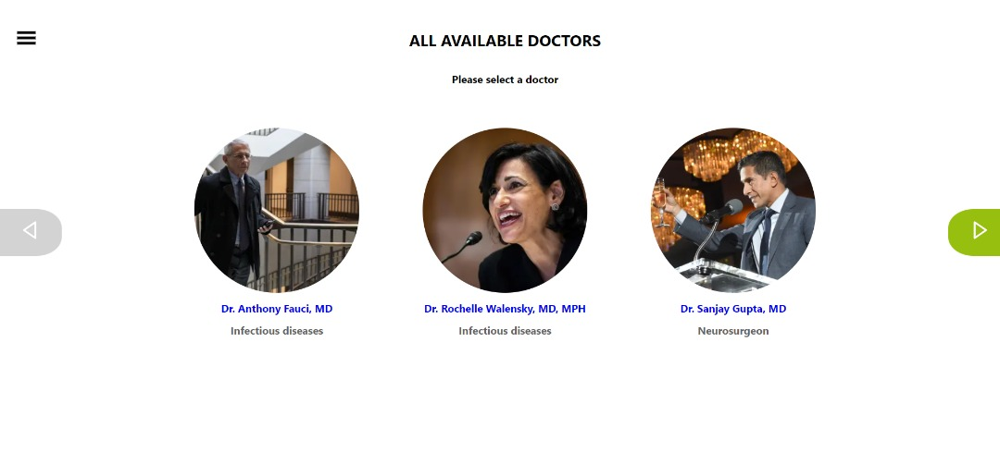
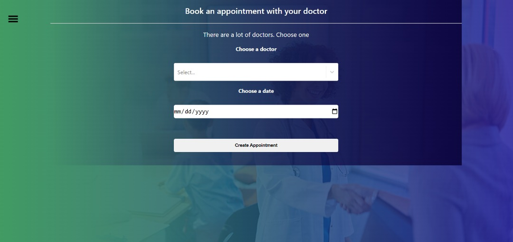
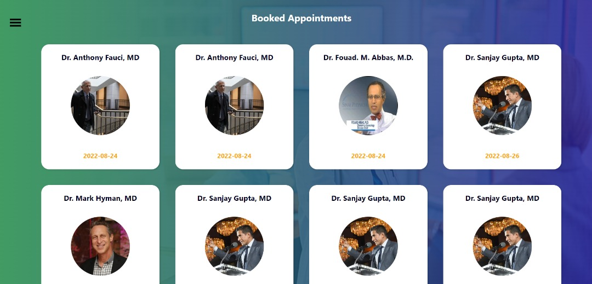
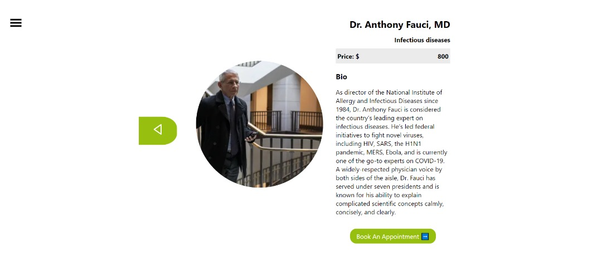
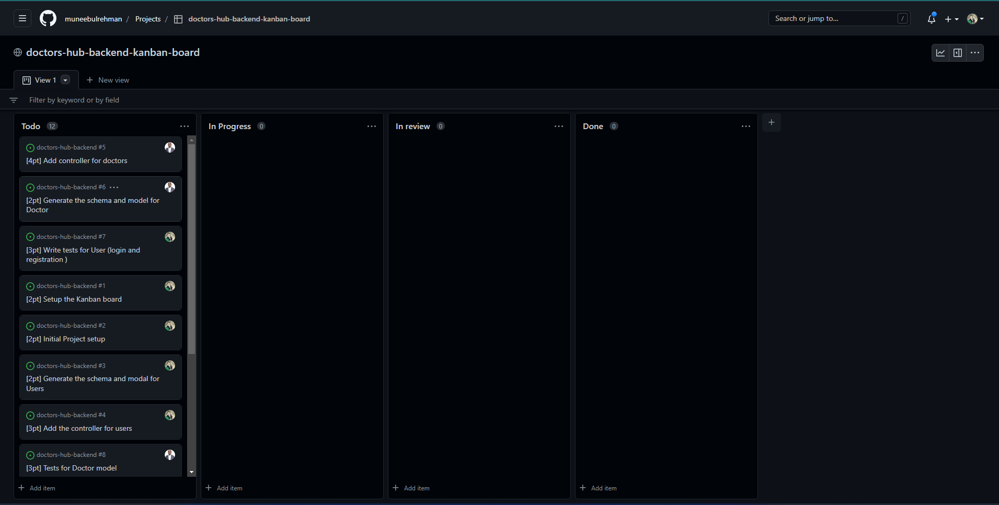

# Doctors Hub frontend

This is the front-end of the **Doctor's Hub** application built with ReactJs. It is a single page application which allows the user to book an appointment with available doctors. Responds to this [API](https://doctors-hub-backend.herokuapp.com/api).

Visit the [Backend repo](https://github.com/muneebulrehman/doctors-hub-backend)

### Preview

### Live version

[Check Live version here](https://doctors-hub-frontend.netlify.app/)

### Kanban Board

[Link](https://github.com/users/muneebulrehman/projects/3)

### Team information

We are a team of three.

1. [@Muneeb ul Rehman](https://github.com/muneebulrehman)
2. [@Ezekiel Utshudi Eteta](https://github.com/EzekielUtshudi)
3. [@Sangwa Didie](https://github.com/sangwa7)

### Built with

- ReactJs
- Redux

## Getting started

#### Prerequisites

- React
- Redux
- CSS
- SCSS

#### Setup

Clone [this](git@github.com:muneebulrehman/doctors-hub-frontend.git) repo

- Navigate to the directory and run `npm install` to install the dependencies.
- Run `npm start` to start the server.

### Authors

👤 **Muneeb Ul Rehman**

- GitHub: [@Muneeb](https://github.com/muneebulrehman)
- Twitter: [@NeatCoder\_](https://twitter.com/NeatCoder_)
- LinkedIn: [Muneeb](https://www.linkedin.com/in/muneebulrehman/)

👤 **Ezekiel Utshudi**

- GitHub: [@EzekielUtshudi](https://github.com/EzekielUtshudi)
- Twitter: [@UtshudiEzekiel](https://twitter.com/UtshudiEzekiel)
- LinkedIn: [@ezekiel-utshudi](https://www.linkedin.com/in/ezekiel-utshudi-195782162/)

👤 **Sangwa Didier**

- GitHub: [Didier Sangwa](https://github.com/sangwa7)
- Twitter: [@sangwa_7](https://twitter.com/sangwa_7)
- LinkedIn: [Didier Sangwa](https://www.linkedin.com/in/didier-sangwa)

### 🤝 Contributions

Contributions, issues, and feature requrests are welcome!

Feel free to check the [issues page](https://github.com/muneebulrehman/doctors-hub-frontend/issues).

### Show your support

Give a ⭐ if you like the project.

### Acknowledgments

Thanks to [Murat Korkmaz](https://www.behance.net/gallery/26425031/Vespa-Responsive-Redesign) for providing the design.

### 📝 License

This project is MIT licensed.
